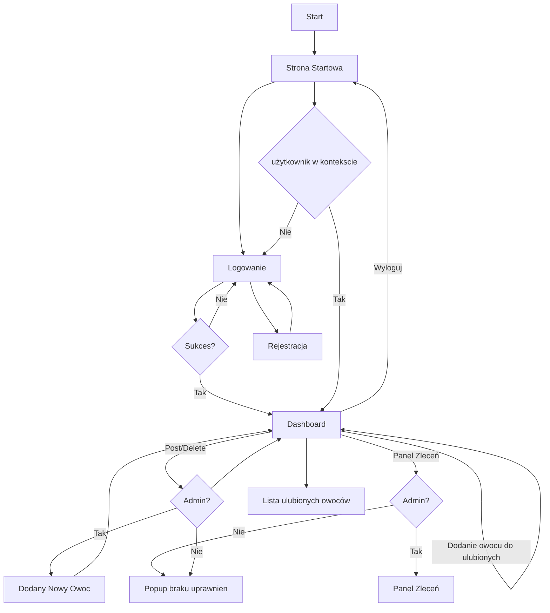

<!-- ### Links:
1. https://github.com/dontlaugh/auth0-rocket-rust-example
1. https://rocket.rs/v0.4/guide/getting-started/
1. https://www.reddit.com/r/rust/comments/8ntc88/authentication_with_rocket/
1. https://mmhaskell.com/blog/2020/8/17/authentication-in-rocket
1. https://crates.io/crates/rocket-auth-login 
1. https://www.youtube.com/watch?v=tjH0Mye8U_A
1. -->

# Projekt Końcowy
## 1.Temat
Aplikacja "UBerry" do wybierania owoców przez pracowników firmy.
## 2.Technologie
* Frontend: framework Vue.js korzystający z Html, css oraz javascript
* Backend: framework [Rocket](https://rocket.rs/) korzystający z języka Rust.
* Baza Danych: sql lite lub MongoDB

Jeśli nastąpią problemy z frameworkiem Rocket który w tej chwili jest w wersji 0.4.6 zostanie on zastąpiony na node.js lub [deno](https://deno.land/)
## 3. Opis
Aplikacja posiada możliwość rejestrowania użytkowników (pracownicy firmy korzystającej z naszych usług).

Logowanie na konta użytkownika lub admina. 

Użytkownicy mają możliwość przeglądania owoców i wyświelenia szczegółów (możliwe rozwinięcie do wybierania konkretnego owoca).
Użytkownicy mogą dodatkowo dodać owoc do listy ulubionych, przeglądać tą listę oraz wybrać owoc na dzień dzisiejszy.

Administrator ma możliwość dodatkowo do usuwania, dodawania lub edycji danego opsiu oraz do panalu zamówień.
W panelu zamówień można byłoby przefiltrować zamówienia według danego dnia lub użytkownika.

## 4. Diagram Działania

